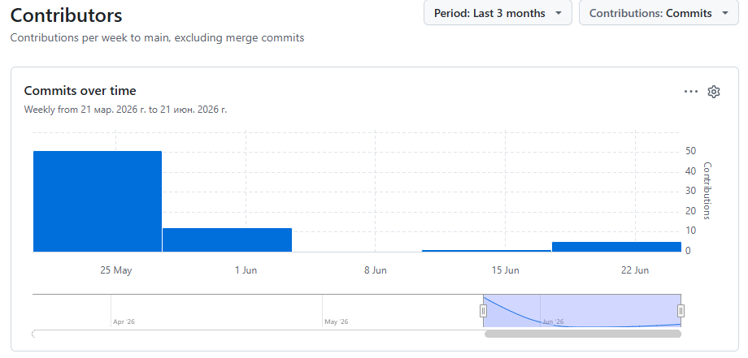

# MathJam — платформа для онлайн-курсов по математике

**MathJam** — это веб-приложение для размещения и изучения онлайн-курсов по математике.  
Проект разработан в рамках курсовой работы по дисциплине «Технология разработки программного обеспечения» (траектория Б: Django REST + React SPA).  
Приложение позволяет пользователям регистрироваться, просматривать курсы, покупать доступ, отслеживать прогресс, сохранять курсы в избранное и восстанавливать удалённые курсы из корзины.

---
## 📊 Статистика разработки

- **Всего коммитов:** 60+  
- **Период разработки:** 18 недель

---

## 🚀 Технологический стек

### Backend
- **Django** — веб-фреймворк
- **Django REST Framework (DRF)** — создание REST API
- **Simple JWT** — JWT-аутентификация (access/refresh токены)
- **SQLite** (разработка) / **PostgreSQL** (продакшен)
- **django-cors-headers** — настройка CORS
- **django-filter** — фильтрация запросов

### Frontend
- **React** — библиотека для построения интерфейсов
- **Vite** — сборщик
- **React Router** — маршрутизация
- **Axios** — HTTP-клиент (перехватчики для JWT)
- **CSS Modules** — изоляция стилей

### Тестирование и документация
- **pytest** + **pytest-django** — модульные тесты бэкенда
- **Vitest** + **React Testing Library** — модульные тесты фронтенда
- **Cypress** — интеграционное (E2E) тестирование
- **drf-spectacular** — OpenAPI 3.0 (Swagger/ReDoc)

### Контейнеризация (опционально)
- **Docker** + **docker-compose** — для продакшен-развёртывания

---

## 📋 Основной функционал

### Публичная часть (доступна всем)
- Просмотр списка курсов (с пагинацией)
- Просмотр карточки курса (описание, цена, рейтинг, список уроков)
- Поиск курсов по названию
- Регистрация и аутентификация (JWT)

### Приватная часть (для авторизованных пользователей)
- Покупка курсов
- Просмотр приобретённых курсов и прогресса
- Отметка уроков как пройденных
- Сохранение курсов в избранное
- Перемещение курсов в корзину восстановления и их возврат
- Редактирование профиля (аватар, уровень математики, контакты)

### Административная часть (для администраторов)
- Управление курсами и уроками (CRUD)
- Управление категориями
- Управление пользователями

---

### Структура проекта
**Backend**
```bash
backend/
├── config/             # Настройки проекта
│   ├── settings.py
│   └── urls.py
├── courses/            # Приложение курсов (модели, API)
├── users/              # Приложение пользователей (аутентификация)
├── media/              # Загруженные изображения
├── static/             # Статические файлы
├── manage.py
└── requirements.txt
```
**Frontend**
```bash
frontend/
├── public/
├── src/
│   ├── components/     # Переиспользуемые компоненты
│   ├── pages/          # Страницы приложения
│   ├── contexts/       # AuthContext
│   ├── services/       # API-клиент (Axios)
│   ├── styles/         # CSS Modules
│   └── App.jsx
├── package.json
└── vite.config.js
```
**Документация и диаграммы**
```bash
docs/
├── diagrams/               # Готовые диаграммы (PNG)
├── sources/                # Исходники диаграмм (PlantUML)
├── screenshots/            # Скриншоты интерфейса
└── testing/                # Скриншоты тестов
```

---

## 🛠 Установка и запуск

### Требования
- Python 3.10+
- Node.js 18+
- npm или yarn

### 1. Клонирование репозитория
```bash
git clone https://github.com/Exaynts/TermPaper2026.git
cd TermPaper2026
```

### 2. Настройка бэкенда
```bash
cd backend
python -m venv venv

# Активация окружения:
# Windows: venv\Scripts\activate
# macOS/Linux: source venv/bin/activate
pip install -r requirements.txt
cp .env.example .env              # Pаполните SECRET_KEY и другие переменные для корректной работы
python manage.py migrate
python manage.py createsuperuser
python manage.py runserver
```

### 3. Настройка фронтенда
```bash
cd ../frontend
npm install
cp .env.example .env              # При необходимости укажите VITE_API_URL
npm run dev
```

### 4. Открыть в браузере
```bash
- Фронтенд: http://localhost:5173
- Админка Django: http://localhost:8000/admin
- API (browsable): http://localhost:8000/api/courses/
```

### 5. Запуск через Docker (продакшен-режим)
Убедитесь, что Docker Desktop запущен
```bash
docker-compose up -d --build
- Фронтенд: http://localhost
- API: http://localhost:8000/api/
- Админка: http://localhost:8000/admin
```

---

## 📚 Документация API
После запуска бэкенда документация доступна по адресам:

- **Swagger UI**: http://localhost:8000/api/schema/swagger-ui/
- **ReDoc**: http://localhost:8000/api/schema/redoc/
- **Сырая OpenAPI-схема (JSON)**: http://localhost:8000/api/schema/

---

## 👥 API-эндпоинты (основные)
  ### Эндпоинты представлены в виде: Метод  Эндпоинт  Описание
- POST	/api/auth/register/	                 Регистрация  
- POST	/api/auth/login/	                   Получение JWT (access/refresh)  
- POST	/api/auth/token/refresh/       	     Обновление access-токена  
- GET/PATCH	/api/auth/profile/	             Профиль пользователя  
- GET	  /api/courses/	                       Список курсов  
- GET	  /api/courses/{id}/	                 Детали курса (с уроками)  
- POST	/api/courses/{id}/purchase/	         Покупка курса  
- POST	/api/courses/{id}/save/            	 Сохранить в избранное  
- POST	/api/courses/{id}/move_to_bin/	     Переместить в корзину  
- POST	/api/courses/{id}/restore_from_bin/	 Восстановить из корзины  
- POST	/api/progress/mark/	                 Отметить урок пройденным  
- GET	  /api/progress/my-progress/	         Прогресс по всем купленным курсам

---

### 🧪 Тестирование
- Бэкенд (pytest)
```bash
cd backend  
pytest -v
```

- Фронтенд (Jest + React Testing Library)  
```bash  
cd frontend  
npm test
```

- Интеграционное тестирование (Cypress)
```bash
cd frontend
npm run test:e2e:open    # интерактивный режим
# или
npm run test:e2e         # автоматический режим (headless)
```

---

📐 Диаграммы и проектная документация
Все диаграммы проекта (Use Case, ER, компонентов, последовательности) хранятся в папке docs/diagrams/
Исходные коды для диаграм имеются в папке docs/sources

---

### 👨‍💻 Автор
Студент группы ПИЖ-б-о-24-1  
Козлов Евгений Александрович  
Направление подготовки: 09.03.04 «Программная инженерия»  
Профиль: «Разработка и сопровождение программного обеспечения»  

### 📄 Лицензия
Проект создан в учебных целях. Не для коммерческого использования.  

